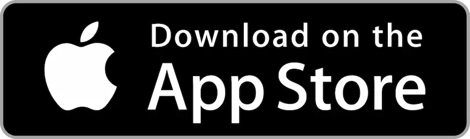

# Mobile Apps

While Koel is accessible on mobile devices through its responsive design, the user experience may not be optimal 
compared to a native app due to inherent limitations of web apps on mobile devices.

For a better mobile experience, it's strongly recommended to use [Koel Player](https://github.com/koel/player),
the official mobile app for Koel, instead. Written in Flutter, Koel Player is available for both [Android](https://play.google.com/store/apps/details?id=phanan.koel.app) and [iOS](https://apps.apple.com/de/app/koel-player/id1576886982?l=en).

<MobileAppScreenshots />

By purchasing Koel Player, you will also be supporting the continuous development of Koel. 
Of course, you can always compile and install the app yourself, as the source code is licensed under MIT.

