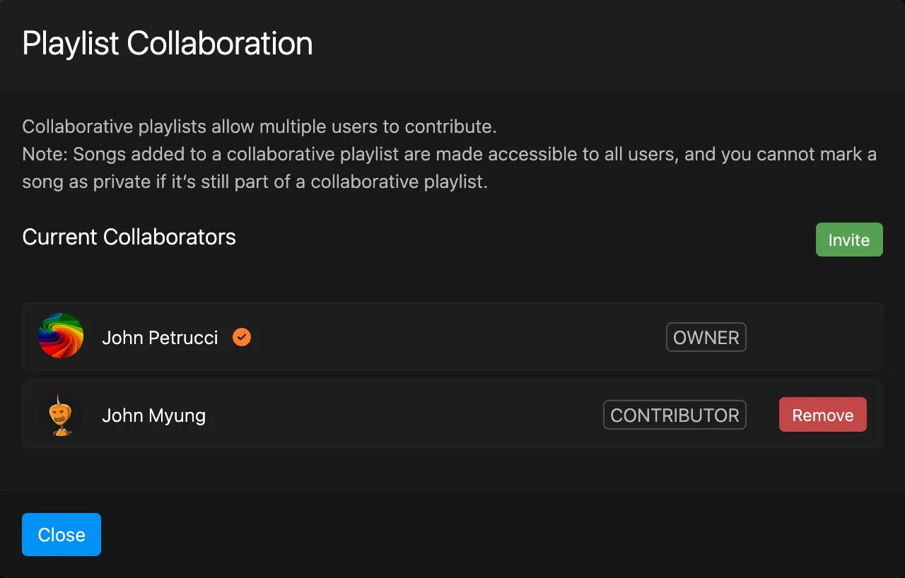

# Collaboration

One of the distinctive features of Koel Plus is the ability for users to share and collaborate with others.
This page will talk you through the process of setting song visibility and playlist collaboration.

## Setting Song Visibility

With Koel Plus, there are two different visibility settings for songs: public and private.

* _Private_ songs are only visible to the uploader (the "owner")
* _Public_ songs are visible to all users (**not** the whole internet!) However, only owner can edit or delete them.

The default visibility for uploaded songs is Private. For other users to be able to see and listen to your music, you need to explicitly mark them as public and vice-versa. This can be done in two ways:

- **On an individual basis**: To mark individual songs as public or private, right-click on the songs to bring up the context menu. From there, you can choose "Mark as Public" or "Mark as Private" depending on the current visibility.
- **Set default upload visibility**: For all future uploads to be public or private by default, you can toggle the "Make uploaded songs public by default" option in your [Profile & Preferences](../usage/profile-preferences#preferences) page. Note that this only affects future uploads, not existing ones.

### Scanning Music

When you scan for music with the `koel:scan` command, discovered songs will be marked as public and assigned to the first admin user. 
You can change this behavior by passing the `--private` option to the command and/or explicitly specify the owner of the songs with the `--owner` option.

```bash
php artisan koel:scan --private --owner=2 
```

### Migrating from Community Edition

When you upgrade Koel from a previous, Community, edition to Koel Plus, all existing music will be marked as public and assigned to the first admin user. 
This is to ensure all existing music is still accessible to everyone, and the first admin user has full control over them.
You can always change the visibility of the songs and/or reassign them to other users as you see fit.

```sql
--- Mark all songs as private
UPDATE songs SET is_public = 0;

--- Assign all songs to another user
UPDATE songs SET user_id = 2;
```

## Playlist Collaboration

A _collaborative playlist_ allows multiple users to add, remove, and reorder songs in a playlist.

:::tip Songs are marked as public
When a song is added to a collaborative playlist, it will be marked as public if it's not already.
In addition, you cannot mark a song as private if it's still part of a collaborative playlist.
:::

To set up or manage collaboration on a playlist, you need to be the playlist's owner. From the sidebar, right-click on the playlist and choose "Collaborate…" from the context menu.
The "Playlist Collaboration" modal should appear.



To invite more collaborators, click the "Invite" button. A link will be generated and copied to your clipboard. Share this link with the users you want to collaborate with. They can then paste the link in their browser to join the playlist.

To remove a collaborator, click the "Remove" button next to their name.

