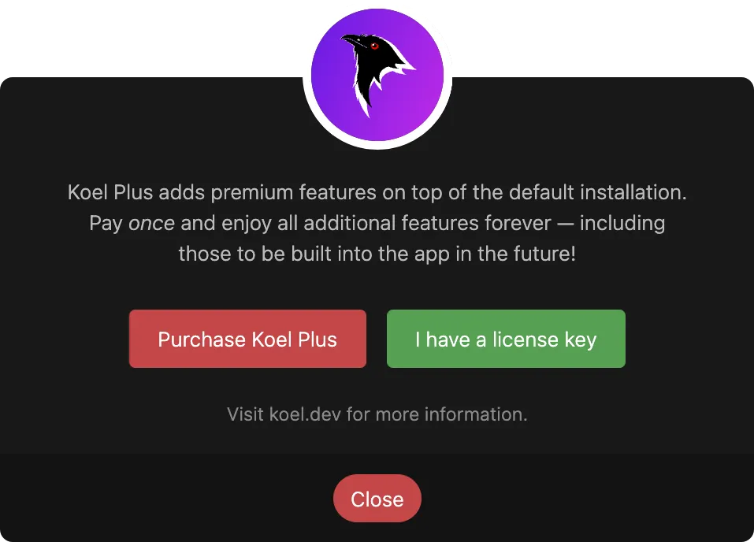

# Purchase & Activation

## Pricing

Koel Plus employs a super simple pricing model: You set your own price starting at {{ config.plus.price }}, __one time__.
You read that right: no subscription, no recurring payments, no hidden fees, no per- or additional-seat costs — I hate those bullshit as much as you do.
Pay __once__, and you get all current _and_ future updates at no extra fee, forever.

::: tip
If the price is still too steep for you, [let me know](mailto:me@phanan.net), and we can work something out.
Also, if you’re a current or past sponsor ❤️, you’re eligible for a discount.
:::

## Purchase

<a class="lemonsqueezy-button" :href="config.plus.purchaseUrl">Click here</a> to purchase Koel Plus.

## Activation

<UISubjectToChangeNote />

After purchasing, you'll receive an email with a license key. To activate Koel Plus, you can use either the web interface or the command line.

### Via the Web Interface

1. Log into your Koel installation as an admin and locate the "Upgrade to Plus" button in the bottom-left corner of the screen.
  
2. Click the button to bring up the "Koel Plus" dialog:
  
3. Click "I have a license key," enter your key in the input field, and click "Activate."
  
4. If the key is valid, Koel will display a Success message and reload itself.

### Via the Command Line

From the root of your Koel installation, run:

```bash
php artisan koel:license:activate YOUR_LICENSE_KEY
```

If the key is valid, you'll see a Success message.

### Verification

To verify that Koel Plus is activated, reload the web app if you haven't done so.
Afterward, trigger the About Koel modal by clicking the <InterfaceIcon :src="iconInfo" /> icon in the bottom-right corner of the screen.
You should see the information about your Koel Plus license in the modal.


## Deactivation

If for any reason you need to deactivate Koel Plus, you can do so via the command line:

```bash
php artisan koel:license:deactivate
```

Reload Koel, and it will revert to the Community edition. You can re-activate it at any time following the steps above.

<script lang="ts" setup>
import { onMounted } from 'vue'
import iconInfo from '../assets/icons/info.svg'
import config from '../config'

onMounted(() => {
  window.createLemonSqueezy()
})
</script>

<style lang="scss" module>
ol img {
  margin: 1.2rem 0;
}
</style>
