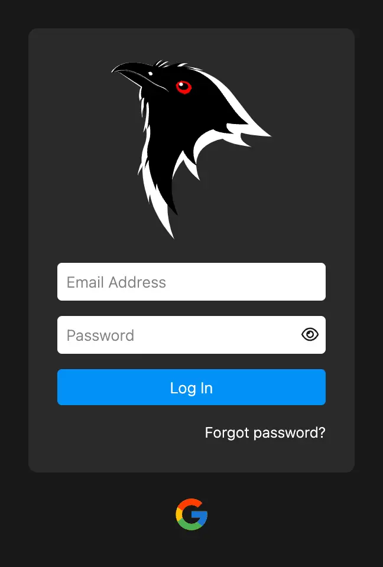

# Single Sign-On

Apart from the default authentication mechanism with email and password, users can also log in to Koel Plus via Single Sign-On (SSO).
As of current, the only supported SSO provider is Google, with more to come in the future.

## Google

To enable SSO with Google, you need to create a new OAuth client ID in the [Google Cloud Console](https://console.cloud.google.com/apis/credentials).
Pick "Web application" as the application type, and set the "Authorized redirect URIs" to `https://<your-koel-domain>/auth/google/callback`,
replacing `<your-koel-domain>` with your actual Koel domain.

<CaptionedImage :src="googleOauth" alt="Google OAuth">Create a new Google OAuth client ID</CaptionedImage>

Afterward, take note of the client ID and client secret values. You can then add them to your `.env` file:

```
SSO_GOOGLE_CLIENT_ID=<your-client-id>
SSO_GOOGLE_CLIENT_SECRET=<your-client-secret>
```

Finally, set the Google-hosted domain that you want to restrict logins. For example, if you only accept users from `your-koel.com`:

```
SSO_GOOGLE_HOSTED_DOMAIN=your-koel.com
```

Save the `.env` file and reload Koel. You should now see a "Log in with Google" button on the login page:



Clicking on the Google button will open a new window where you can log in with your Google account (make sure to allow pop-ups if you have a pop-up blocker enabled).

## User Management

When a user logs in via SSO for the first time, a new user account will be created in Koel with the email address, name, avatar, and the SSO ID obtained from the SSO provider.
If, however, there's already an existing user with the same email address , Koel will merge the two accounts with a sensible merging strategy.

SSO users can update their name and avatar, but not their email address. Furthermore, a new user created via SSO does not have a password set and won't be able to log in via the email+password method.

<script lang="ts" setup>
import googleOauth from '../assets/img/plus/google-oauth.webp'
</script>
