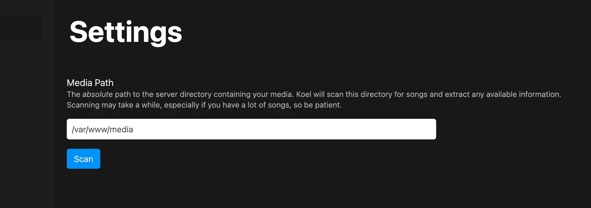

# Music Discovery

There are several ways for Koel to discover your media files. In the most common scenario, you will have a directory on your server where you store your music files.
You can let Koel know where this directory is (the "media path") via the [web interface](#scan-via-the-web-interface) or the [CLI](../cli-commands#koel-storage-local).

:::danger Keep media out of Koel’s directory
Do NOT place your media files inside Koel’s directory. Though technically possible, doing so will make upgrading, downgrading, and reinstalling Koel much more tedious.
:::

Once the media path is set, you can scan for songs (either manually or [using a cron job](../cli-commands#command-scheduling)), configure a watcher, or upload files directly via the web interface.

:::tip Cloud Storage
With [Koel Plus](../plus/what-is-koel-plus), you can also use cloud storage services like Amazon S3 or Dropbox to store your media files. Refer to [Storage Support](../plus/cloud-storage-support) for more details.
:::

## Scan via the Web interface

:::warning Not for large libraries
Scanning via the web interface is vulnerable to HTTP timeouts and memory limit, so if you have a decent-sized library, opt for other methods instead.
:::

Upload your songs into a readable directory on your server and configure Koel to scan and sync it by setting a "media path" under Manage → Settings.



Once set, click the "Scan" button to start the process. Koel will scan the directory and its subdirectories for audio files and add them to the database.
All popular audio formats (`.mp3`, `.ogg`, `.aac`, `.m4a`, `.opus`, and `.flac`) are supported.

## Scan Using the CLI

You can also scan from the CLI with the artisan `koel:scan` command. This method is faster, without a time or library-size limit, and provides useful feedbacks.

```bash
php artisan koel:scan

   INFO  Scanning /var/www/media

 1189/1189 [============================] 100%

   INFO  Scanning completed!

  ⇂ 1150 new or updated song(s)
  ⇂ 39 unchanged song(s)
  ⇂ 0 invalid file(s)
```

Suffix the command with a `-v` flag for more details e.g. scanning errors.

This command can be added as a cron job, for example to run every midnight:

```bash
0 0 * * * cd /home/user/webapps/koel/ && /usr/local/bin/php artisan koel:scan >/dev/null 2>&1
```

A better approach is to use Laravel’s built-in scheduler. See [Command Scheduling](../cli-commands#command-scheduling) for more details.

## Upload via the Web Interface
You can upload songs directly as an admin by clicking the "Upload" sidebar menu item or just drag and drop files and folders into the web interface.
Note that if you’re not using a cloud storage (available with Koel Plus), you will need to set the media path first,
as the files will be uploaded into the `%media_path%/__KOEL__UPLOADS__` directory.

Depending on how big your files are, you may want to set `upload_max_filesize` and `post_max_size` in your `php.ini` correspondingly, or uploading may fail with a `Payload too large` error.
This applies even if you’re using a cloud storage, as the files will be uploaded to your server first before being sent to the cloud.

## Watch the Media Directory

You can also watch your media directory and trigger _selective_ synchronization every time there's a change to it with the help of `inotifywait`.
In order to start using the feature, follow these steps:

### 1. Install `inotify` Tools

On CentOS for example, you can run this shell command:

``` bash
sudo yum --enablerepo=epel -y install inotify-tools
```
### 2. Set Up a Watcher Script

Now you need to set up a watcher script to run `inotifywait` and send the output to `koel:scan` artisan command. For example, you can create a sample `watch` file in Koel’s root directory with this content:

``` bash
#!/bin/bash

MEDIA_PATH=/var/www/media/
PHP_BIN=/usr/local/bin/php

inotifywait -rme move,close_write,delete --format "%e %w%f" $MEDIA_PATH | while read file; do
  $PHP_BIN artisan koel:sync "${file}"
done
```
### 3. Run the Watcher in the Background

Following the above example:

``` bash
chmod +x watch
./watch
[Ctrl+z]
bg
disown -h
```

You can now verify that it works by `tail -f storage/logs/laravel.log` while making changes to your media directory, for example by adding or removing applicable files via FTP.

## Integration with AWS Lambda

:::warning Deprecated
Though still functional, this method is deprecated in favor of configuring S3 as a [cloud storage](../plus/cloud-storage-support).
:::

Starting from version v3.0.0, Koel can work seamlessly with Amazon S3 with the help of the [official Koel-AWS package](https://github.com/koel/koel-aws). This allows you to run Koel in your server and have all media files hosted on S3.

### How It Works

1. You upload media files to your S3 bucket
2. S3 sends events to a Lambda function
3. The Lambda function calls Koel’s API to sync the media into Koel’s database
4. You create a streaming request to Koel
5. Koel gets the media from S3 and streams it to you

<div style="height: 12px"></div>


### Supports and Requirements

As of current, only `mp3`, `ogg`, `m4a`, and `flac` files are supported.

### Step-by-Step Installation

#### 1. Prepare S3 for Streaming

  1. Create an IAM user, e.g. `koel-user`
  2. Create a bucket, e.g. `koel-bucket`
  3. Make sure `koel-user` can read `koel-bucket`'s  content. You can simply attach the `AmazonS3ReadOnlyAccess` policy to `koel-user`.
  4. Allow CORS on `koel-bucket`
      ```xml
      <CORSConfiguration>
          <CORSRule>
              <AllowedOrigin>*</AllowedOrigin>
              <AllowedMethod>GET</AllowedMethod>
              <MaxAgeSeconds>3000</MaxAgeSeconds>
              <AllowedHeader>Authorization</AllowedHeader>
          </CORSRule>
      </CORSConfiguration>
      ```

#### 2. Configure Lambda for Syncing

1. Clone Koel-AWS's repository: `git clone https://github.com/phanan/koel-aws`
2. Install necessary packages: `cd koel-aws && npm install --production`
3. Copy `.env.example` into `.env` and edit the variables there
4. Zip the whole directory's content into something like `archive.zip`
5. In AWS Lambda console, create a Lambda function with the following information:
    ```
    Name: koel-lambda
    Runtime: Node.js
    Code entry type: Upload a .ZIP file (you'll upload the zip file created in step 4 here)
    Handler: index.handler
    Role: S3 execution role (a new window will appear, where you can just click next next and next)
    Memory (MB): 128 should be fine
    Timeout: 0min 10sec
    VPC: "No VPC" should be fine
    ```
    :::info AWS region
    Make sure you're creating the function in the same region with `koel-bucket`.
    :::

#### 3. Configure S3 to send events to Lambda

Under `koel-bucket` "Events" section, create an event with the following details:

```
Name: <Just leave it blank>
Events: ObjectCreated(All), ObjectRemoved(All)
Prefix: <Empty>
Suffix: <Empty>
Send To: Lambda function
Lambda function: koel-lambda
```

#### 4. Configure Koel to Stream from S3

If everything works properly, you can now upload media files to the bucket, and they should appear in Koel. Now after you populate `koel-user`'s `AWS_ACCESS_KEY_ID`, `AWS_SECRET_ACCESS_KEY`, and `AWS_REGION` into your Koel's `.env` file, Koel will start streaming media from your S3.
