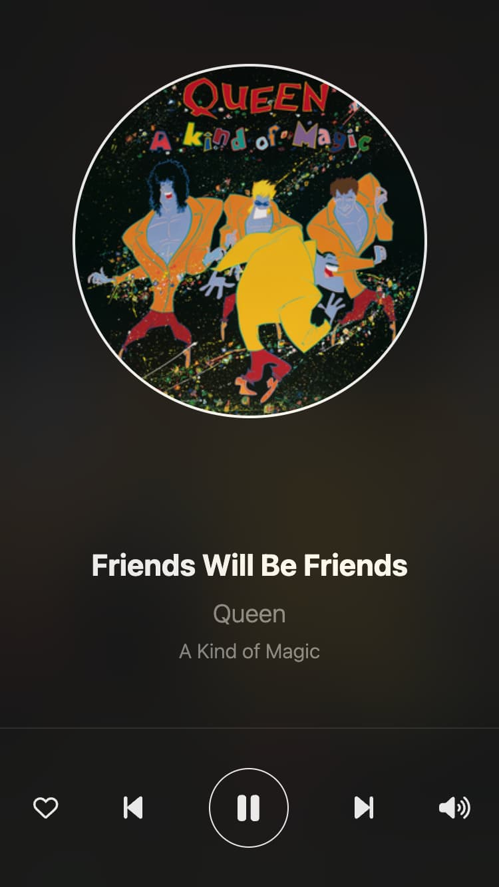

# Remote Controller

Koel has a built-in remote controller that lets you control a desktop instance.

## Configuration


In order for the remote controller to work, [register](https://dashboard.pusher.com/accounts/sign_up) for a Pusher account
and create an app. Then, populate the app's credentials into `.env`:

```
PUSHER_APP_ID=
PUSHER_APP_KEY=
PUSHER_APP_SECRET=
PUSHER_APP_CLUSTER=
```

Finally, reload your Koel instance to apply the changes.

## Usage

You can access the remote controller by visiting `https://<your-koel-domain>/remote`.

:::tip
You can pin the remote controller to your phone's home screen for quick access.
:::

The remote controller will scan for an active Koel instance. 
If found, it will connect to it and allow you to control the playback as well as like/unlike the current song and adjust the volume.



