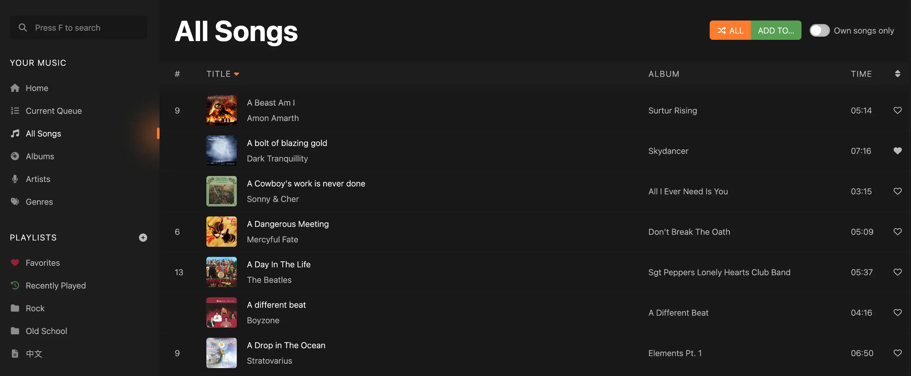
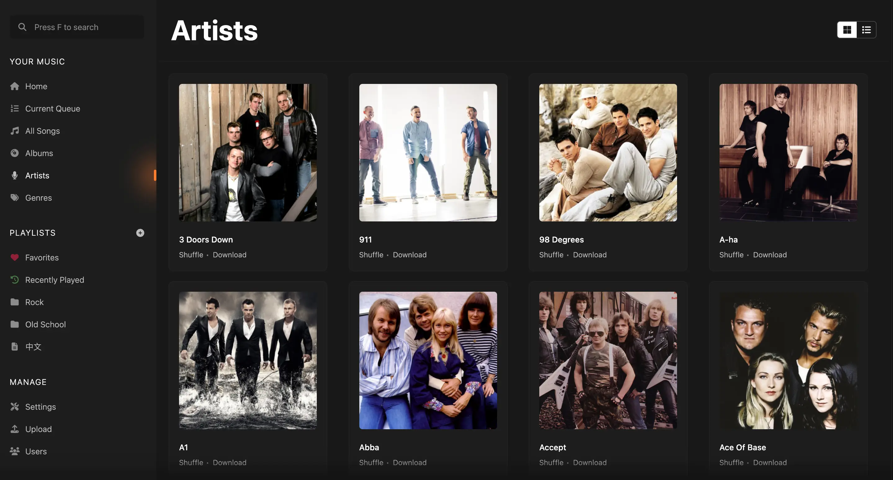
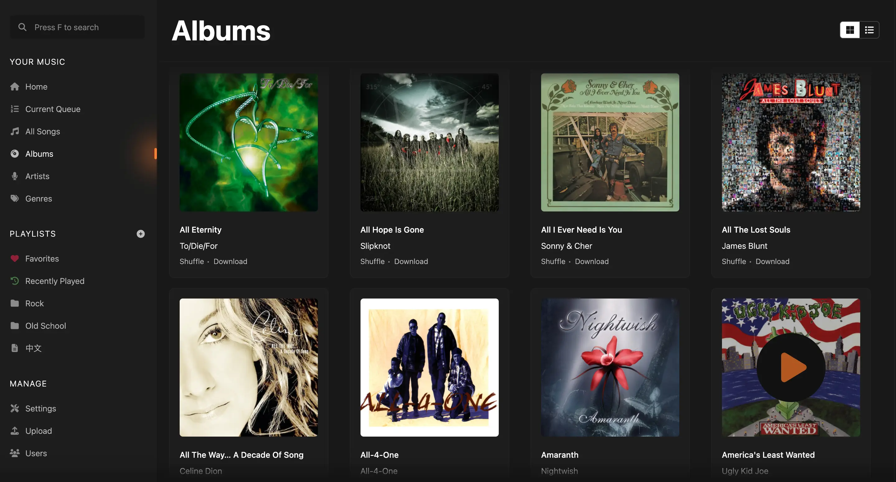
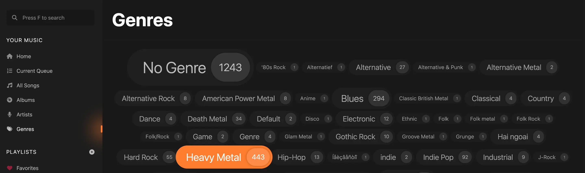

# Using the Web Interface

<UISubjectToChangeNote />

Koel’s web interface is designed to be as simple and intuitive as possible, drawing inspiration from the best music players out there. Here’s a quick rundown of what you can do with it.

## Browsing and Searching for Music

The navigation bar on the left side of the screen is where you can find all the main features of Koel.
You can browse your music library by songs…

artists…

albums…

or genres:

You can click on any artist, album, or genre name to see all the songs that belong to it.
On the artist and album screens, you can also find other albums and songs by the same artist as well as extra metadata
like the artist or album's information when [configured](../service-integrations).

On any screen with a song list (a "song-list screen") you can:

* Sort the list by clicking on the column headers
* Filter the list by typing in the filter box (marked with <InterfaceIcon :src="filterIcon" alt="Filter" />)
* Select a song by clicking on it. To select multiple songs, hold down <kbd>Shift</kbd> or <kbd>Ctrl/Cmd</kbd> while clicking.
* Drag and drop one or more songs to reorder them when applicable
* Drag and drop one or more songs to applicable menu items to the left to perform actions like adding to a playlist, queueing, or marking them as favorite
* Right-click on a song to bring up a context menu with options to play, queue, mark as favorite, add to a playlist, and more

To search globally for songs, artists, and albums, see [Instant Search](./search).

## Streaming Music

Play a song by double-clicking on it or pressing <kbd>Enter</kbd> on either a song list row or a song card.
Queue a song (or multiple songs) by right-clicking and choose one of the Queue options, or by dragging and dropping it
into the queue menu item.

You can use the dedicated button (with the <InterfaceIcon :src="shuffleIcon" alt="Shuffle" /> icon) to shuffle the current list or the selected songs.
To play in order instead of shuffling, hold down <kbd>Alt/Option</kbd> while clicking the button.

When a song is playing, you can control playback using the buttons at the bottom of the screen as well as
rewind/fast-forward the song by clicking and dragging the progress bar.

From the same area, you also can:

* <InterfaceIcon :src="heartIcon" alt="Heart" /> like/unlike the current song
* <InterfaceIcon :src="volumeIcon" alt="Volume" /> control the volume
* <InterfaceIcon :src="repeatIcon" alt="Repeat" /> switch between repeat modes
* <InterfaceIcon :src="slidersIcon" alt="Sliders" /> show the equalizer
* <InterfaceIcon :src="boltIcon" alt="Bolt" /> show the visualizer
* <InterfaceIcon :src="expandIcon" alt="Expand" /> toggle full-screen mode

Right-clicking the footer area brings up context menu for the currently playing song.

## Creating and Managing Playlists

Koel supports creating an unlimited number of playlists as well as organizing them into folders.
Start by clicking the <InterfaceIcon :src="plusIcon" alt="Add" /> button next to the "Playlists" header in the navigation bar. You'll be provided with three options:

* "New Playlist…" brings up a dialog to create a standard playlist
* "New Smart Playlist…" brings up a dialog to create a smart playlist
* "New Folder…" brings up a dialog to create a playlist folder

Creating a standard playlist or playlist folder should be straightforward, as you only need to supply a name.
Once a playlist or playlist folder is created, you can:

* Drag and drop songs into a standard playlist to add them
* Drag and drop playlists a playlist folder to organize them. You can also drag and drop a playlist out of its folder.

For a smart playlist, you can define the criteria that determine which songs are included in the playlist,
and Koel will automatically update the playlist based on those criteria.
For example, with the criteria shown in the following screenshot:

Koel will include in the playlist:

* all songs by Pink Floyd, and
* songs by Iron Maiden that have been played more than 99 times by the current user

There are a great variety of criteria to choose from, and you can combine them in any way you like, providing a powerful tool for creating dynamic playlists.

## Editing Songs

As an admin (Community edition) or song owner (Koel Plus), you can edit a song's metadata by right-clicking on it and choosing "Edit…".
A dialog will appear, allowing you to change the song's title, artist, album, genre, lyrics, and more.

You can also edit multiple songs at once, in which case the changes will be applied to all of them.

## Downloading Songs

If `ALLOW_DOWNLOAD` is set to `true` (the default value) in your `.env` file, you can download a song by right-clicking on it and choosing "Download."
You can also download several songs, all songs from an album, all songs by an artist, or a whole playlist, though it might be resource-intensive for large collections.

:::tip `zip-ext` required
Downloading multiple songs requires the [`zip` extension](https://www.php.net/manual/en/book.zip.php) to be installed and enabled in your PHP environment.
Koel will silently fail if this requirement is not met.
:::

## Deleting Songs

As an admin (Community edition) or song owner (Koel Plus), you can delete a song by right-clicking on it and choosing "Delete from Filesystem."
You'll be prompted to confirm the deletion, and once confirmed, the song will be removed from the database and the filesystem.

:::danger Backup on Delete
By default, Koel keeps a backup of the song before deleting it.
You can disable this behavior by setting `BACKUP_ON_DELETE` to `false` in your `.env` file, but be aware that this will make it impossible to recover a song once it's deleted.
:::

## Share a Song

You can share a song by right-clicking on it and choosing "Copy Shareable URL."
This will copy a URL to the clipboard that can then be shared with anyone with a Koel account.

## Keyboard Shortcuts

Koel has a number of keyboard shortcuts to make it easier to navigate and control playback.
Note that these shortcuts are only triggered when the focus is not on an input field (including the volume control and the music track)
or a textarea.

* <kbd>f</kbd> puts the focus into the search box and triggers the instant search screen
* <kbd>Enter</kbd> plays a song. If multiple songs are being selected, <kbd>Enter</kbd> adds them to the bottom of the queue, <kbd>Shift</kbd>+<kbd>Enter</kbd> queues them to top. Adding a <kbd>Cmd</kbd> or <kbd>Ctrl</kbd> into the combo plays the first selected song right away.
* <kbd>Space</kbd> toggles playback
* <kbd>j</kbd> plays the next song in queue
* <kbd>k</kbd> plays the previous song in queue
* <kbd>l</kbd> marks/unmarks the current song as favorite
* <kbd>r</kbd> circles through repeat modes (no repeat, repeat all, repeat one)
* <kbd>→</kbd> seeks forward 10 seconds
* <kbd>←</kbd> seeks backward 10 seconds
* <kbd>↑</kbd> increases volume by 10%
* <kbd>↓</kbd> decreases volume by 10%
* <kbd>m</kbd> mutes/unmutes
* <kbd>Cmd/Ctrl</kbd>+<kbd>a</kbd> selects all songs in the current song-list screen when the list is focused
* <kbd>Delete</kbd> removes selected song(s) from the current queue/playlist

With a browser that supports [MediaSession](https://developer.mozilla.org/en-US/docs/Web/API/MediaSession) — basically, all modern browsers — you can control Koel using hardware media keys without even having Koel _or the browser_ focused.

